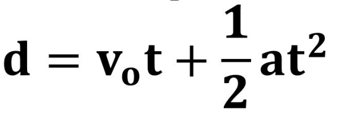
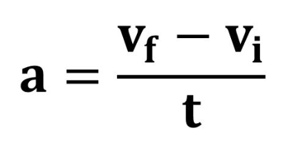
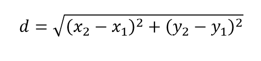
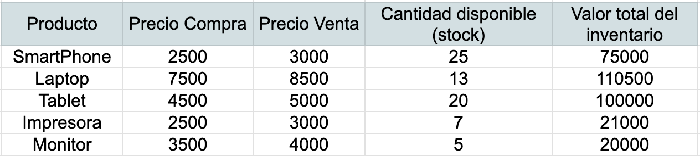
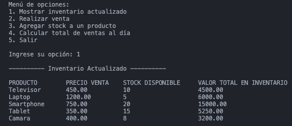

# Programas en C.

## Tabla de contenido

- [Tabla de contenido](#tabla-de-contenido)
- [Objetivo](#objetivo)
- [Elección del IDE](#elección-del-ide)
- [Pasos de Compilación](#pasos-de-compilación)
- [Ejercicios 1 - Primeros Programas](#ejercicios-1---primeros-programas)
  - [Saludo](#saludo)
  - [Saludo 2](#saludo-20)
- [Ejercicios 2 - Entrada de Datos](#ejercicios-2---entrada-de-datos)
  - [Entrada de datos](#entrada-de-datos)
  - [Adivinar número](#adivinar-número)
  - [Problema de física](#problema-de-física)
  - [Distancia entre dos puntos](#distancia-entre-dos-puntos)
- [Ejercicios 3 - Estructuras Condicionales](#ejercicios-3---estructuras-condicionales)
  - [Par o Impar](#par-o-impar)
  - [Múltiplos](#multiplo)
  - [Boletos de Avión](#boletos-de-avión)
  - [Cálculo de áreas de figuras](#cálculo-de-áreas-de-figuras)
- [Ejercicios 4 - Estructuras Iterativas](#ejercicios-4---estructuras-iterativas)
  - [Contador de Números](#contador-de-números)
  - [Contador de números pares e impares](#contador-de-números-pares-e-impares)
  - [Divisores de un número](#divisores-de-un-número)
  - [Números Primos](#números-primos)
  - [Figuras](#figuras)
  - [Números de Fibonacci](#números-de-fibonacci)
- [Ejercicios 5 - Procedimientos y Funciones](#ejercicios-5---procedimientos-y-funciones)
  - [Cantidad de billetes](#cantidad-de-billetes)
  - [Máximo Común Divisor](#máximo-común-divisor)
- [Ejercicios 6 - Manejo de Arreglos unidimensionales y bidimensionales](#ejercicios-6---manejo-de-arreglos-unidimensionales-y-bidimensionales)
  - [Números Random](#números-random)
  - [Números Random 1.1.0](#números-random-110)
  - [Búsqueda de un Número en un Arreglo](#búsqueda-de-un-número-en-un-arreglo)
  - [Arreglos Bidimensionales](#arreglos-bidimensionales)
  - [Manejo de Arreglos Bidimensionales y Archivos](#manejo-de-arreglos-bidimensionales-y-archivos)
- [Ejercicios 7 - Manejo de Archivos](#ejercicios-7---manejo-de-archivos)
  - [Lista de nombres](#lista-de-nombres)
- [Ejercicios Extras](#extras)
  - [Cálculo de importe y el IVA](#cálculo-del-importe-y-el-iva)
  - [Palindromo](#palindromo)
  - [Gestión de inventario y ventas de productos](#gestión-de-inventario-y-ventas-de-productos)

## Objetivo

En este repositorio se encuentran varios ejercicios de programación utilizando el `Lenguaje C`.

El objetivo es que sea usado con fines de estudio, práctica, auto aprendizaje o como guía para todos los programadores que estén aprendiendo C o que ya tengan conocimientos en este lenguaje.

El repositorio contiene ejercicios para resolver o consultar código. Se busca que los ejercicios aborden los conceptos básicos del lenguaje, tales como:

- Sentencias simples de escritura
- Declaración de variables
- Estructuras de control condicionales
- Estructuras de control iterativas
- Procedimientos y funciones con paso de parámetros
- Procedimientos y funciones con paso de parámetros por valor y por referencia
- Manejo de arreglos
- Definición de nuevos tipos de datos
- Manejo de archivos
- Manejo de arreglos bidimensionales (matrices)
- Estructuras de datos tipo registros y arreglos de registros

Se tratará de cubrir todos estos temas con ejercicios, y se fomentará el feedback constructivo para mejorar continuamente el contenido del repositorio.

[Volver a la Tabla de Contenido](#tabla-de-contenido)

## Elección del IDE

La elección del IDE depende de tus preferencias personales y del sistema operativo que estés utilizando. Si eres principiante, [Code::Blocks](http://www.codeblocks.org/) o [Dev-C++](https://sourceforge.net/projects/orwelldevcpp/) pueden ser buenas opciones por su simplicidad.

Otra herramienta es [Visual Studio Code](https://code.visualstudio.com/) es un editor de código ligero pero potente, con soporte para una gran cantidad de lenguajes de programación, incluyendo C. Es altamente personalizable con extensiones.

[Volver a la Tabla de Contenido](#tabla-de-contenido)

## Pasos de Compilación

1. Abre una terminal.
2. Navega al directorio donde se encuentra el archivo `.c` que deseas compilar.
3. Usa el siguiente comando:

   ```bash
   gcc nombre_del_archivo.c -o nombre_del_programa
   ```

4. Ejecuta el programa con:

   ```bash
   ./nombre_del_programa
   ```

[Volver a la Tabla de Contenido](#tabla-de-contenido)

## Ejercicios 1 - Primeros Programas

### Saludo

#### Objetivo

Realizar un programa cuya tarea es desplegar un saludo y luego tu nombre.

#### Resultado esperado en consola

```bash
  Hola Mundo de GITHUB!
  Mi nombre es Eduardo
  Este es mi primer programa para GITHUB
```

[Solución - Saludo](Ejercicio%201%20-%20Hola%20Mundo/saludo.c)

[Volver a la Tabla de Contenido](#tabla-de-contenido)

### Saludo 2.0

#### Objetivo

Imprimir en pantalla un marco rectangular de 30 espacios de ancho y 9 de alto, usando el carácter correspondiente a la primera letra de tu nombre.

#### Resultado esperado en consola

```bash
  EEEEEEEEEEEEEEEEEEEEEEEEEEEEEEE
  EEEEEEEEEEEEEEEEEEEEEEEEEEEEEEE
  EE                           EE
  EE                           EE
  EE ¡Bienvenido a Lenguaje C! EE
  EE                           EE
  EE                           EE
  EEEEEEEEEEEEEEEEEEEEEEEEEEEEEEE
  EEEEEEEEEEEEEEEEEEEEEEEEEEEEEEE

  Sigue Programando :)
```

[Solución - Saludo 2.0](Ejercicio%201%20-%20Hola%20Mundo/saludo2.c)

[Volver a la Tabla de Contenido](#tabla-de-contenido)

## Ejercicios 2 - Entrada de Datos

### Entrada de datos

#### Objetivo

Realizar un programa que pide al usuario datos referentes a su nombre, edad, promedio de su escuela,nombre de su escuela y primera letra de su país, al final se despliega la información dada por el usuario.

#### Resultado esperado en consola

```bash
  ¡Hola!

  ¿Cual es tu nombre?
  Eduardo

  ¿Que edad tienes?
  23

  ¿Que promedio obtuviste en la preparatoria?
  8.89

  ¿Como se llama tu escuela?
  Universidad Autónoma Metropolitana Unidad Iztapalapa

  Escribe la primer letra de tu país:
  M

  Eduardo tienes 23 años, estudias en Universidad Autónoma Metropolitana Unidad Iztapalapa y tienes 8.89 de promedio, la inicial de tu país es: M
```

[Solución - Entrada de Datos](Ejercicio%202%20-%20Entrada%20de%20Datos/datos.c)

[Volver a la Tabla de Contenido](#tabla-de-contenido)

### Adivinar número

#### Objetivo

Este programa tiene como objetivo adivinar un número pensado por el usuario a través de una serie de pasos interactivos. El usuario deberá seguir las instrucciones que se mostrarán en pantalla y, cada vez que realice un paso, presionará la tecla Enter. Al final, solo se pedirá el resultado final obtenido por el usuario, y el programa adivinará el número pensado.

Instrucciones:

1. Inicio: El usuario debe pensar en un número, pero no debe ingresarlo en el programa.

2. Pasos Interactivos: A continuación, se presentarán una serie de pasos que el usuario deberá seguir. Cada vez que el usuario complete un paso, deberá presionar Enter para avanzar al siguiente paso.

3. Ingreso del Resultado: El programa pedirá al usuario que ingrese el resultado final que obtuvo después de realizar las operaciones indicadas.

4. Cálculo para adivinar el numero:

   - Al número que resultó de las operaciones anteriores, réstale 250.
   - Luego, divide el resultado entre 100.

Nota:
Cada vez que el usuario oprime Enter, el programa capturará la acción, pero no se almacenará ningún valor específico. Para esto, se puede utilizar la instrucción:

```bash
getc(stdin);
```

Esta función detiene la ejecución del programa hasta que el usuario presione Enter, permitiendo que el programa avance sin capturar ni almacenar ningún valor.

#### Resultado esperado en consola

```bash
---------- ADIVINAR NUMERO ----------

Piensa en un numero y oprime enter cuando lo haya hecho


Multiplique el numero por 5 y oprime enter cuando lo haya hecho


Sume 12 a lo que quedo y oprime enter cuando lo haya hecho


Multiple por 10 lo que quedo y oprime enter cuando lo haya hecho


Sume 5 a lo que quedo y oprime enter cuando lo haya hecho


Multiplique lo que quedo por 2 y oprime enter cuando lo haya hecho


¿Que numero te quedo?
950

El numero pensado fue: 7
```

[Solución - Adivinar Número](Ejercicio%202%20-%20Entrada%20de%20Datos/adivinarNumero.c)

[Volver a la Tabla de Contenido](#tabla-de-contenido)

### Problema de física

#### Objetivo

Haz un programa que resuelva el siguiente problem de física.

`Un avión parte de reposo y debe alcanzar los 80m/s en 50s. ¿Qué distancia debe tener la pista de despegue?`

Fórmula para el cálculo de la distancia:



Para la aceleración calculada con la ecuación.



#### Resultado esperado en consola

```bash
---------- Problema de Física ----------

Un avion parte del reposo y debe alcanzar los 80m/s en 50s.
¿Que distancia debe tener la pista de despegue?

Aceleración (a) = 1.60 m/s^2

La distancia es = 2000.00 m
```

[Solución - Problema de Física](Ejercicio%202%20-%20Entrada%20de%20Datos/mrua.c)

[Volver a la Tabla de Contenido](#tabla-de-contenido)

### Distancia entre dos puntos

#### Objetivo

Hacer un programa para calcular la distancia entre dos puntos con coordenadas (x1, x2) y (y1, y2). Haciendo uso de la siguiente fórmula:



Nota: Incluir la librería `<math.h>` para usar las funciones `pow` y `sqrt`:

- `pow(b,p)`: calcula `b` elevado a la potencia de `p`.
- `sqrt(x)`:calcula la raíz cuadrada de `x`.

#### Resultado esperado en consola

```bash
---------- Distancia Entre Dos Puntos ----------

Introduce las coordenadas
x1 = 5
x2 = 1
y1 = 3
y2 = 1

La distancia entre los puntos es: 4.472136
```

[Solución - Distancia Entre Dos Puntos](Ejercicio%202%20-%20Entrada%20de%20Datos/distanciaDosPuntos.c)

[Volver a la Tabla de Contenido](#tabla-de-contenido)

## Ejercicios 3 - Estructuras Condicionales

### Par o Impar

#### Objetivo

Realizar un programa que determina si un número ingresado por el usuario es PAR o IMPAR.

#### Resultado esperado en consola

```bash
---------- PAR o IMPAR ----------

Introduce un numero: 2

El numero 2 es PAR
```

```bash
---------- PAR o IMPAR ----------

Introduce un numero: 5

El numero 5 es IMPAR
```

[Solución - Par o Impar](Ejercicio%203%20-%20Estructuras%20Condicionales/par-impar.c)

[Volver a la Tabla de Contenido](#tabla-de-contenido)

### Múltiplos

#### Objetivo

Hacer un algoritmo para que dados dos enteros ingresados por el usuario, se diga si uno es múltiplo del otro.

#### Resultado esperado en consola

```bash

Ingresa el primer numero: 5

Ingresa el segundo numero: 35

35 es múltiplo de 5
```

```bash
---------- MÚLTIPLOS ----------

Ingresa el primer numero: 5

Ingresa el segundo numero: 2

5 y 2 no son múltiplos
```

[Solución - Múltiplos](Ejercicio%203%20-%20Estructuras%20Condicionales/multiplos.c)

[Volver a la Tabla de Contenido](#tabla-de-contenido)

### Boletos de Avión

#### Objetivo

Escribir un programa para preguntar al usuario la edad de 3 personas que viajarán en un avión, luego indicar el costo a pagar por cada uno y el monto total, considerando que el costo del boleto es de 2000 pesos y se tienen los siguientes descuentos:

- niños menores de 2 años tienen un descuento del 100%
- niños de hasta 12 años tienen un descuento del 30%
- personas de 60 años o más tienen un descuento del 50%
- si la edad no cae dentro de alguno de los rangos anteriores, no hay descuento.

#### Resultado esperado en consola

```bash
---------- Costos de Boletos de Avión -----------

Introduce la edad de la persona 1: 1

Introduce la edad de la persona 2: 10

Introduce la edad de la persona 3: 69

Costo de boleto por persona: 2000
Costo persona 1 (100% descuento): 0 pesos
Costo persona 2 (30% descuento): 1400 pesos
Costo persona 3 (50% descuento): 1000 pesos

Total a Pagar: 2400 pesos

```

[Solución - Boletos de Avión](Ejercicio%203%20-%20Estructuras%20Condicionales/boletosAvion.c)

[Volver a la Tabla de Contenido](#tabla-de-contenido)

### Cálculo de áreas de figuras

#### Objetivo

Realizar un algoritmo para calcular el área de un triángulo, rectángulo, cuadrado o círculo, según lo desee el usuario.

#### Resultado esperado en consola

```bash
Selecciona una opción para el cálculo del área
1) Triángulo
2) Rectángulo
3) Cuadrado
4) Círculo
Opción: 4

----- Área del Círculo -----

Ingresa la radio: 2

El área del Círculo es: 12.57
```

[Solución - Cálculo de área](Ejercicio%203%20-%20Estructuras%20Condicionales/areaFiguras.c)

[Volver a la Tabla de Contenido](#tabla-de-contenido)

## Ejercicios 4 - Estructuras Iterativas

### Contador de Números

#### Objetivo

Hacer un algoritmo que pide varios números enteros al usuario y cuando el usuario da un cero el programa escribe cuántos números dio en total y termina. Haciendo uso de `mientras-haz` y `haz-mientras`

#### Resultado esperado en consola

```bash
---------- Contador de Números ----------

Da varios números y para terminar da un 0
1
2
3
4
5
6
7
8
9
0

Diste un total de 9 números
```

[Solución 1 - Contador de Números](Ejercicio%204%20-%20Estructuras%20Iterativas/contadorNumeros.c)

[Solución 2 - Contador de Números](Ejercicio%204%20-%20Estructuras%20Iterativas/contadorNumeros2.c)

[Volver a la Tabla de Contenido](#tabla-de-contenido)

### Contador de números pares e impares

#### Objetivo

Analiza el siguiente pseudocódigo.

```c
Constante N ← 10
Algoritmo
Comienza
  Entero num,cont, nPares, nImpares;
  nPares ← 0;
  nImpares ← 0;
  Para cont←1 a N (conPaso + 1) hacer
  Comienza
    Escribe( “Ingresa un número positivo: “);
    Lee(num);
    Si (num >= 0) entonces
      Si( num MOD 2 == 0) entonces //es par
        nPares ← nPares +1;
      Otro //es impar
        nImpares ← nImpares +1;
    Otro
    Comienza
      Escribe(“ El numero “,num,” no es positivo”);
      cont ← cont -1;
    Termina
  Termina
Termina
```

El algoritmo le pide al usuario N números enteros positivos y al terminar dice al usuario cuántos fueron pares y cuántos impares.
Escribe un programa en C codificando el algoritmo presentado.

#### Resultado esperado en consola

```bash
---------- Contador de números Pares e Impares ----------

Ingresa un número positivo: 1

Ingresa un número positivo: 2

Ingresa un número positivo: 3

Ingresa un número positivo: 4

Ingresa un número positivo: 5

Ingresa un número positivo: -6
El número -6 no es positivo

Ingresa un número positivo: 6

Ingresa un número positivo: 7

Ingresa un número positivo: 8

Ingresa un número positivo: 9

Ingresa un número positivo: 10

El numero de números pares es: 5

El numero de números impares es: 5
```

[Solución - Par e Impar](Ejercicio%204%20-%20Estructuras%20Iterativas/par-impar.c)

[Volver a la Tabla de Contenido](#tabla-de-contenido)

### Divisores de un número

#### Objetivo

Escribe un programa en C en donde su tarea es desplegar todos los divisores de un número dado por el usuario. Un divisor será el que divide al numero, por lo que todos los divisores se encuentran en el intervalo de 1 a numero.

Por ejemplo, los divisores del número 28 son: 1, 2, 4, 7, 14 y 28.

Usando el tipo de estructura iterativa Repite-Hasta

#### Resultado esperado en consola

```bash
---------- Divisores de un Número ----------

Ingresa un número entero: 28

Los divisores del numero 28 son:
1 2 4 7 14 28

El número total de divisores de 28 es: 6

```

[Solución - Divisores de un número](Ejercicio%204%20-%20Estructuras%20Iterativas/divisores.c)

[Volver a la Tabla de Contenido](#tabla-de-contenido)

### Números Primos

#### Objetivo

Desplegar todos los números mayores deb 50, menores que 1000 y que sean primos.

#### Resultado esperado en consola

```bash
---------- Números primos entre 50 y 1000 ----------
Los números primos entre el 50 y 1000 son:
53 59 61 67 71 73 79 83 89 97 101 103 107 109 113 127 131 137 139 149 151 157 163 167 173 179 181 191 193 197 199 211 223 227 229 233 239 241 251 257 263 269 271 277 281 283 293 307 311 313 317 331 337 347 349 353 359 367 373 379 383 389 397 401 409 419 421 431 433 439 443 449 457 461 463 467 479 487 491 499 503 509 521 523 541 547 557 563 569 571 577 587 593 599 601 607 613 617 619 631 641 643 647 653 659 661 673 677 683 691 701 709 719 727 733 739 743 751 757 761 769 773 787 797 809 811 821 823 827 829 839 853 857 859 863 877 881 883 887 907 911 919 929 937 941 947 953 967 971 977 983 991 997
```

[Solución - Números Primos](Ejercicio%204%20-%20Estructuras%20Iterativas/primo.c)

[Volver a la Tabla de Contenido](#tabla-de-contenido)

### Figuras

#### Objetivo

Hacer las siguientes figuras usando anidamiento de ciclos

#### Resultado esperado en consola

```bash
Primera figura

        * * * * * * * * * *
        * * * * * * * * * *
        * * * * * * * * * *
        * * * * * * * * * *
        * * * * * * * * * *
        * * * * * * * * * *
        * * * * * * * * * *
        * * * * * * * * * *
        * * * * * * * * * *
        * * * * * * * * * *

Segunda figura

        * * * * * * * * * *
          * * * * * * * * *
            * * * * * * * *
              * * * * * * *
                * * * * * *
                  * * * * *
                    * * * *
                      * * *
                        * *
                          *
```

[Solución - Figuras](Ejercicio%204%20-%20Estructuras%20Iterativas/figuras.c)

[Volver a la Tabla de Contenido](#tabla-de-contenido)

### Números de Fibonacci

#### Objetivo

Hacer un programa donde se le pida a el usuario un número, el programa deberá calcular el número Fibonacci que pertenece el número dado.

#### Resultado esperado en consola

```bash
---------- Números de Fibonacci ----------

Que número de Fibonacci deseas obtener: 21


El número en Fibonacci es: 10946


¿Deseas obtener otro número? s/n
n

¡Adios!
```

[Solución - Números de Fibonacci](Ejercicio%204%20-%20Estructuras%20Iterativas/fibonacci.c)

[Volver a la Tabla de Contenido](#tabla-de-contenido)

## Ejercicios 5 - Procedimientos y Funciones

### Cantidad de billetes

#### Objetivo

Dada una cantidad de dinero (en pesos) decir cuántos billetes con denominación 1000, 500, 200, 100, 50 y 20 pesos deben darse de tal forma que se entregue la mínima cantidad de billetes y el resto con monedas.

Modularizar el programa definiendo:

Una función que recibe como parámetro una cantidad de dinero y una denominación de billetes (1000, 500, 200, 100, 50 o 20) . El módulo desplegará cuántos billetes de la denominación pasada como parámetro deberá entregar al usuario, luego el módulo devolverá la cantidad de dinero que queda, después de dar dichos billetes.
Por ejemplo, si el módulo recibe los parámetros 24315 y 1000, desplegará:

“Se entregan 24 billetes de 1000 pesos.”

Y el valor regresado por la función será: 315

Un procedimiento que reciba una cantidad de dinero y despliegue que esa cantidad se regresará en monedas. Por ejemplo, si recibe 8 como parámetro, el módulo desplegará: “Se entregan 8 pesos en monedas.”

#### Resultado esperado en consola

```bash
Ingresa la cantidad de dinero: 12458

Se entregan 12 billetes de 1000 pesos
Se entregan 2 billetes de 200 pesos
Se entrega 1 billete de 50 pesos
Se entregan 8 pesos en monedas

¿Quieres dar otra cantidad? s/n
n

¡Adios!
```

[Solución - Cantidad de Billetes](./Ejercicio%205%20-%20Procedimientos%20y%20funciones/modularizar.c)

[Volver a la Tabla de Contenido](#tabla-de-contenido)

### Máximo Común Divisor

#### Objetivo

Escribe una función que reciba dos números enteros, A y B, como parámetros formales y calcule el máximo común divisor de ellos. Realiza los siguientes pasos:

1.  En dicho módulo define dos apuntadores, apA y apB, e inicializar con las direcciones de A y B.

2.  Escribe el valor de A, B, &A, &B, apA, apB, *apA, *apB. Para escribir el valor de un apuntador (dirección) utiliza el formato: %p (para desplegar en código hexadecimal)

    - A y B: enteros
    - &A y &B : direcciones
    - apA y apB: direcciones *apA y *apB: enteros

3.  Codifica el pseudocódigo visto en clase para el cálculo del MCD, pero realiza el cálculo accesando a A y B únicamente desde sus apuntadores. Asegúrate de que A sea el número mayor y B el menor.

4.  Escribe el módulo main definiendo dos variables (num1 y num2) de tipo entero. Luego pide al usuario que ingrese dos enteros para calcular su MCD, leyendo las variables num1 y num2. Enseguida invoca a la función que calcula el MCD y escribe el resultado.

#### Resultado esperado en consola

```bash
---------- Máximo Común Divisor ----------

Introduce 2 números enteros

Número 1: 2
Número 1: 8

Valor de A = 2 B = 8

&A = 0x7ff7b05473ec &B = 0x7ff7b05473e8

apA = 0x7ff7b05473ec apB = 0x7ff7b05473e8

*apA = 2 *apB = 8

El MCD es: 2
```

[Solución - Máximo Común Divisor](./Ejercicio%205%20-%20Procedimientos%20y%20funciones/mcd.c)

[Volver a la Tabla de Contenido](#tabla-de-contenido)

## Ejercicios 6 - Manejo de Arreglos unidimensionales y bidimensionales

### Números Random

#### Objetivo

Generar 20 números aleatorios y guardar los números dentro de una arreglo.

#### Resultado esperado en consola

```bash
---------- Números Aleatorios ----------
82 88 36 27 23 71 23 77 31 19 76 29 63 75 52 47 56 63 10 31
```

[Solución - Números Random](./Ejercicio%206%20-%20Manejo%20de%20Arreglos%20unidimensionales%20y%20bidimensionales/random.c)

[Volver a la Tabla de Contenido](#tabla-de-contenido)

## Números Random 1.1.0

#### Objetivo

A continuación vamos a modularizar el ejercicio [Números Random](#números-random) de la manera siguiente:

1. Declara un procedimiento `Inicializa Arreglo` que se encarga de inicializar con números aleatorios las celdas (o casillas) de un arreglo y recibe los siguientes parámetros formales:

   ```c
   void Inicializa_arreglo(int Arreglo[], int size, int max_valor)
   ```

   El primer parámetro de salida (Arreglo) es el arreglo de enteros que será inicializado. El segundo parámetro (de entrada) indica el tamaño del arreglo Arreglo y el tercer parámetro (también de entrada) indica el máximo valor aleatorio que se asignará a las casillas del arreglo (el mínimo es 0).

2. A continuación declara el tipo cadena (abajo de la declaración de constantes):

   ```c
   typedef char cadena[256];
   ```

3. Luego escribe otro procedimiento llamado `Despliega Arreglo` que recibe tres parámetros formales (los tres son parámetros de entrada):

   ```c
   void Despliega_arreglo( int Arreglo [], int size, cadena mensaje)
   ```

   El primer parámetro de entrada es el arreglo de enteros a escribir en pantalla. Los elementos del arreglo se separan con un espacio en blanco y sólo al final se salta línea. El segundo parámetro es el tamaño del arreglo y el tercero es un mensaje de encabezado que se debe escribir antes de desplegar los números.

4. Declara otra `constante MAX con valor 10`.
   Modifica el módulo main: declara otro arreglo de enteros (DATOS) de tamaño MAX e invoca a los módulos escritos anteriormente, como se muestra a continuación

#### Resultado esperado en consola

```bash
---------- Números Aleatorios ----------

Arreglo con valores entre 0 y 100
31 80 11 77 53 91 12 35 18 42 64 33 4 100 33 0 73 86 33 16

Arreglo con valores entre 0 y 20
5 7 3 7 17 2 8 1 0 6 1 14 5 2 15 15 17 15 4 20
```

[Solución - Números Random 1.1.0](./Ejercicio%206%20-%20Manejo%20de%20Arreglos%20unidimensionales%20y%20bidimensionales/random2.c)

[Volver a la Tabla de Contenido](#tabla-de-contenido)

### Búsqueda de un Número en un Arreglo

#### Objetivo

1.  Haz un módulo que reciba como parámetro de salida un arreglo de enteros a inicializar, el tamaño del arreglo y un intervalo de valores que aleatoriamente se asignarán a las casillas del arreglo:

    ```c
    void Inicializa_arreglo(int Arreglo[], int size, int min_valor, int max_valor)
    ```

    por ejemplo, si queremos que el arreglo se inicialice con valores aleatorios entre 10 y 40, la invocación sería así:

    ```c
    Inicializa_arreglo(Arreglo, NUM_ELEMS, 10, 40)
    ```

2.  Haz un módulo que sirva para desplegar los números del arreglo, basándose en lo ejercicios anteriores.

3.  Haz una función que reciba como parámetro de entrada un arreglo de enteros, el tamaño del arreglo y un número entero:

    ```c
    int Cuenta(int Arreglo[], int size, int num)
    ```

    el módulo contará cuántas veces aparece el valor de `num` dentro del arreglo.

4.  Haz un procedimiento que reciba como parámetro de entrada un arreglo de enteros, el tamaño del arreglo y un número entero:

    ```c
    void Despliega_Posiciones (int Arreglo[], int size, int num)
    ```

    el módulo desplegará las `posiciones` donde el valor de `num` está en el arreglo.

5.  Haz una función que reciba como parámetro de entrada un arreglo de enteros, el tamaño del arreglo y un número entero:

    ```c
    int Busca(int Arreglo[], int size, int num)
    ```

    el módulo buscará el valor de `num` en el arreglo y regresará la posición donde aparece por primera vez (la primera ocurrencia de num). Si no aparece, la función regresará el tamaño del arreglo (un índice fuera de rango).

6.  Escribe el módulo main como se muestra a continuación:

    ```c
    int main()
    {
      int Numeros [NUM_ELEMS]; //declaración de arreglo de enteros
      int elem;

      Inicializa_arreglo (Numeros, NUM_ELEMS, 20,30);

      Despliega_arreglo (Numeros, NUM_ELEMS,”Arreglo con valores entre 20 y 30: ”);

      printf(“Da un numero a buscar en el arreglo: \n”);
      scanf(“%d”, &elem);

      if ( Busca( Numeros, NUM_ELEMS, elem) < NUM_ELEMS) //si existe
      {
        printf(“EL numero %d aparece %d veces en el arreglo\n”, elem, Cuenta(Numeros , NUM_ELEMS, elem));

        Despliega_Posiciones( Numeros, NUM_ELEMS, elem);

        printf(“EL numero %d aparece por primera vez en la posición: %d \n”,elem, Busca(Numeros, NUM_ELEMS, elem));
      }
      else printf(“EL numero %d no existe en el arreglo\n”, elem);
    }
    ```

#### Resultado esperado en consola

```bash
Ingresa un número entero: 21

Arreglo con valores entre 10 y 40

16 35 31 28 31 30 35 30 25 17 17 24 17 39 27 14 18 18 11 36 29 22 40 29 39 14 22 18 37 22 16 23 40 18 21 18 23 12 15 34


El número 21 aparece 1 veces en el arreglo

Posiciones donde se encuentra el número 21 son:
34

El número 21 aparece por primera vez en la posición: 34
```

[Solución- Búsqueda de un número](./Ejercicio%206%20-%20Manejo%20de%20Arreglos%20unidimensionales%20y%20bidimensionales/search-num.c)

[Volver a la Tabla de Contenido](#tabla-de-contenido)

### Arreglos Bidimensionales

#### Objetivo

Escribe un programa en C en donde se definan las siguientes constantes:

```c
RENGS = 5
COLS = 4
```

Escribe un procedimiento que recibe como parámetro un arreglo bidimensional de enteros y sus dimensiones, para inicializar todos los elementos del arreglo con números enteros aleatorios en el intervalo de 1 a 10.

```c
void inicializaMatriz(int matriz[RENGS][COLS])
```

Escribe un procedimiento para desplegar un arreglo bidimensional recibido como parámetro.

```c
void despliegaMatriz(int matriz[RENGS][COLS]);
```

Escribe un módulo main en donde se declaren 2 arreglos de enteros locales bidimensionales: MA y MB de Tamaño RENGS x COLS. Invoca a Inicializa_matriz dos veces para inicializar los arreglos MA y MB con números entre 1 y 10 , luego invoca dos veces a Despliega_matriz para desplegar los dos arreglos.

Declara un módulo que reciba como parámetro tres arreglos A,B yC de tamaño RENGS x COLS. EL objetivo del módulo es sumar las entradas de A y B y guardar el resultado en las entradas de C. Invoca al módulo Despliega_matriz para desplegar el contenido de C después de la suma.

Declara un módulo que reciba como parámetro un arreglos A de tamaño RENGS x COLS y un entero X. EL objetivo del módulo es multiplicar la matriz A por el escalar X, dejando el resultado en A mismo. Invoca al módulo Despliega_matriz para desplegar el contenido de A después de la multiplicación.

#### Resultado esperado en consola

```bash
--------------------
   8  10   4   9
   1   3   5   9
   4  10   1   6
   3   3   8   4
   8  10   1   3

--------------------
   4  10  10   8
   1   4  10   9
   7   6   8   7
   3   8   1   4
  10  10  10   2

--------------------
  12  20  14  17
   2   7  15  18
  11  16   9  13
   6  11   9   8
  18  20  11   5

--------------------
  40  50  20  45
   5  15  25  45
  20  50   5  30
  15  15  40  20
  40  50   5  15
```

[Solución - Arreglos Bidimensioanles](./Ejercicio%206%20-%20Manejo%20de%20Arreglos%20unidimensionales%20y%20bidimensionales/matriz.c)

[Volver a la Tabla de Contenido](#tabla-de-contenido)

### Manejo de Arreglos Bidimensionales y Archivos

#### Objetivo

Escribe una función siguiente que pide memoria al sistema para crear una matriz de reales `float` de tamaño `rengs x cols`.

```c
float **crearMatrizFloat(int rengs, int cols);
```

Luego escribe un procedimiento que genera números aleatorios entre 0 y 1 considerando cifras decimales (`numDecimal`).

```c
float numeroDecimalRandom(int numDecimal);
```

Escribe un procedimiento que recibe como parámetro un arreglo bidimensional de reales y sus dimensiones, para inicializar todos los elementos del arreglo con números reales aleatorios en el intervalo [0, 10].

```c
void inicializaMatrizAleatorio(float **Matriz, int rengs, int cols);
```

Escribe un procedimiento para desplegar un arreglo bidimensional recibido como parámetro.

```c
void despliegaMatriz(float **Matriz, int rengs, int cols);
```

Escribe un modulo `main` que realice los pasos siguientes:

1. Declara un arreglo bidimensional y otro unidimensional para crearse dinámicamente.

2. Declara dos variables enteras: `renglones` y `columnas`.

3. Pregunta al usuario el tamaño (`renglones` y `columnas`) de la matriz a trabajar.

4. Crea la matriz invocando a la función `creaMatrizFloat`.

5. Invoca al módulo `inicializaMatrizAleatorio` para inicializar la matriz creada.

6. Despliega la matriz generada invocando al módulo `despliegaMatriz`.

7. Crea un arreglo de reales de tamaño `renglones` y haz un procedimiento para guardar en cada entrada `i` del arreglo la suma del renglón `i-ésimo` de la matriz, despliega el resultado.

8. Escribe un procedimiento para guardar la matriz en un archivo txt. 

#### Resultado esperado en consola

```bash
Ingresa el tamaño de los renglones: 3
Ingresa el tamaño de las columnas: 2

--------------------
  7.2  9.2
  8.0  4.0
  7.2  2.8


--------------------
16.40 12.00 10.00 

Archivo Matriz.txt abierto exitosamente
```

[Solución - Manejo de Arreglos Bidimensionales y Archivos](./Ejercicio%206%20-%20Manejo%20de%20Arreglos%20unidimensionales%20y%20bidimensionales/matriz2.c)

[Volver a la Tabla de Contenido](#tabla-de-contenido)

## Ejercicios 7 - Manejo de Archivos

### Lista de nombres

#### Objetivo

- Codifica el procedimiento de la opción 1, con los parámetros formales siguientes:

```c
void Inserta(cadena Nombres[ ], int *size, int tam_max);
```

este procedimiento primero validará que el arreglo Nombres no esté lleno (cuando `size == tam_max`), en ese caso se pedirá al usuario un nombre y una posición del arreglo donde se insertará el nombre dado. Si la posición dada es mayor o igual que size, el nombre se insertará en la posición indicada por `size` (al final), luego size debe incrementarse en uno.
En otro caso, si la posición es positiva menor que `size`, el elemento se insertará en la posición indicada recorriendo una casilla a la derecha los elementos a partir de esa posición), luego `size` debe incrementarse en uno.
En caso de que la posición sea negativa o que el arreglo esté lleno se indicará al usuario el error correspondiente.

- Codifica el procedimiento de la opción 4, con los parámetros formales siguientes:

```c
void Despliega(cadena Nombres[ ], int size);
```

este procedimiento desplegará todos los nombres almacenados en el arreglo, incluye un encabezado antes del desplegado. Compila y corre el programa seleccionando varias veces las opciones 1 y 4.

- Codifica el procedimiento de la opción 2, con los parámetros formales siguientes:

```c
void Elimina(cadena Nombres[ ], int *size);
```

este procedimiento primero validará que el arreglo `Nombres` no esté vacío (cuando `size` es mayor que 0), en ese caso se pedirá al usuario una posición del arreglo donde se borrará el nombre existente.
Si la posición es positiva menor que size, el elemento de la posición indicada se eliminará, recorriendo una casilla a la izquierda los elementos a partir de esa posición en adelante, luego size debe decrementarse en uno.
En caso de que la posición sea negativa o que el arreglo esté vacío se indicará al usuario el error correspondiente. Compila y corre el programa seleccionando varias veces las opciones 1, 2 y 4.

- Codifica la función de la opción 3, con los parámetros formales siguientes:

```c
int Busca(cadena Nombres[ ], int size, cadena name);
```

esta función buscará el nombre pasado como parámetro de entrada, name, en el arreglo y regresará la posición donde se encuentra. En caso de que el nombre no se encuentre, se regresará el valor de `size` como posición. Compila y corre el programa seleccionando varias veces las opciones 1, 2, 3, 4 y da 5 para terminar. Nota: usa la función `strcpy(cad1, cad2)` para asignar a `cad1` el valor de `cad2` y la función `strcmp(cad1, cad2)` para checar si dos cadenas son iguales.

- Usa el siguiente código para crear un archivo.

```c
FILE *openFile(cadena name, cadena type)
{
    FILE *ap = NULL;

    ap = fopen(name, type); // Función de C para abrir un archivo

    if (ap == NULL)
        printf("\nERROR...No se pudo abrir el archivo '%s'\n", name);
    else
        printf("\nArchivo '%s' abierto exitosamente\n", name);

    waitToPressEnter();

    return ap;
}
```

- Crear un método para poder los  nombres de las listas en un archivo de texto (tipo 'txt').
- Crear otra función para poder los nombres dentro del archivo de texto.

[Solución - Lista de nombres](./Ejercicio%207%20-%20Manejo%20de%20Archivos/lista-nombres.c)

[Volver a la Tabla de Contenido](#tabla-de-contenido)

## Ejercicios Extras

### Cálculo del Importe y el IVA

#### Objetivo

Elabora un programa que calcule el total a pagar por pedidos de platillos que realiza un cliente.

1. El usuario deberá solicitar al usuario.

   - Nombre del cliente
   - Nombre del platillo (sin IVA incluido)
   - Cantidad

2. El programa deberá.

- Calcular y mostrar el importe

  `importe = precio * cantidad`

- Calcular y mostrar el IVA

  `IVA = importe * 0.16`

- Calcular y mostrar el total a pagar

  `Total a pagar = importe * IVA`

#### Resultado esperado en consola

```bash
          ********** DATOS DEL ESTUDIANTE **********

Nombre del estudiante: XXXXX XXXXX XXXXX
Matricula: XXXXXXXXXX
Grupo: XXXXXX

Ingresa el nombre del cliente: Eduardo


          ********** DATOS DEL PEDIDO DE COMIDA **********

Ingrese el nombre del platillo: Pizza

Ingrese el precio del platillo sin IVA: 250

Ingrese la cantidad del platillo: 2

Importe sin IVA: 500.00

IVA: 80.00

          DATOS DEL CLIENTE Y TOTAL A PAGAR CON IVA

Nombre del cliente: Eduardo

Total a pagar del pedido con IVA: 580.00
```

[Solución - Cálculo del Importe y el IVA](Ejercicios%20Extras/Calculo%20importe%20y%20el%20IVA/platillos.c)

[Volver a la Tabla de Contenido](#tabla-de-contenido)

### Palindromo

#### Objetivo

Realizar un código en C donde el usuario introduzca una frase. El algoritmo debe verificar si la frase del usuario es un Palindromo.

#### Resultado esperado en consola

```bash
---------- Palindromo ----------

Introduce una frase:
Anita lava la tina

La frase 'Anita lava la tina' es un Palindromo
```

```bash
---------- Palindromo ----------

Introduce una frase:
Hola como estas

La frase 'Hola como estas' no es un Palindromo
```

[Solución - Palindromo](Ejercicios%20Extras/Palindromo/palindromo.c)

[Volver a la Tabla de Contenido](#tabla-de-contenido)

### Gestión de inventario y ventas de productos

#### Objetivo

El programa deberá presentar un menu de la siguiente manera:

El programa debe permitir al usuario realizar las siguientes operaciones.

1. Inicialización de Inventario:

   Deberás definir un inventario inicial de 5 productos con nombres, precios de compra, precios de venta, cantidad disponible (stock) y el valor total del inventario.

   Ejemplo de productos:
   

2. Menú de opciones:

   ```bash
   Menú de opciones:
   1. Mostrar inventario actualizado
   2. Realizar venta
   3. Agregar stock a un producto
   4. Calcular total de ventas al día
   5. Salir

   Ingrese su opción:
   ```

3. Mostrar inventario actualizado:

   Mostrar el nombre del producto, precio de venta, cantidad disponible y valor total en inventario.

   `valor total de inventario = precio de venta * cantidad disponible`

   

4. Realizar venta:

   Permitir al usuario seleccionar un producto para venta. Ingresar la cantidad de unidades a vender y calcular el precio total de la venta. Restar la cantidad vendida del stock disponible.

   `precio total de la venta = precio venta * cantidad de unidades vendidas`

   ```bash
   ---------- Ventas ----------

    Lista de Productos.

    1. Televisor
    2. Laptop
    3. Smartphone
    4. Tablet
    5. Cámara

    Seleccione el producto a vender: 2

    Ingrese la cantidad de unidades a vender: 2

    Venta realizada exitosamente
    Monto total: 2400.00

   ```

5. Agregar stock a un producto:

   Permitir al usuario seleccionar un producto para agregar stock, ingresar la cantidad de unidades a agregar y sumar esta cantidad al stock disponible.

   ```bash
   ---------- Agregar stock a un producto ----------

   Lista de Productos.
   1. Televisor
   2. Laptop
   3. Smartphone
   4. Tablet
   5. Cámara

   Seleccione el producto a vender: 2

   Ingrese la cantidad de unidades a agregar: 8

   Stock actualizado. Nuevo stock de Laptop: 11
   ```

6. Calcular total de ventas del día:

   Sumar todos los montos de las ventas realizadas y mostrar el total.

   ```bash
   ---------- Ventas del dia ----------

   Total de ventas del dia: 2400.00
   ```

7. Salir:

   Terminar la ejecución del programa

   ```bash
   Menú de opciones:
   1. Mostrar inventario actualizado
   2. Realizar venta
   3. Agregar stock a un producto
   4. Calcular total de ventas al día
   5. Salir

   Ingrese su opción: 5

   ¡Hasta luego!
   ```

[Solución - Gestión de inventario y ventas](Ejercicios%20Extras/Gestión%20de%20inventario%20y%20ventas)

[Volver a la Tabla de Contenido](#tabla-de-contenido)

## Title

### Name Project

#### Objetivo

#### Resultado esperado en consola

```bash

```

[Solución](url)

[Volver a la Tabla de Contenido](#tabla-de-contenido)
